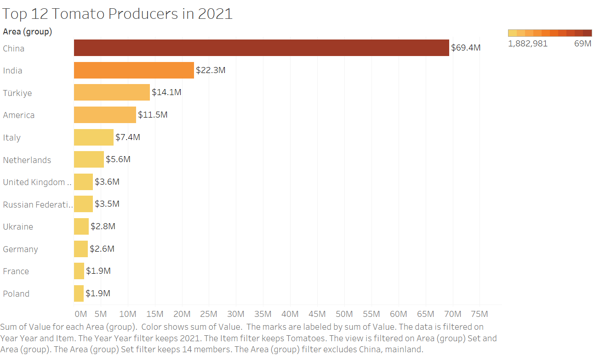

| [home page](https://lihongzhang2023.github.io/portfolio/) | [visualizing debt](visualizing-government-debt) | [critique by design](critique-by-design) | [final project I](final-project-part-one) | [final project II](final-project-part-two) | [final project III](final-project-part-three) |

# Critique by Design

<noscript></noscript><object class='tableauViz'  style='display:none;'><param name='host_url' value='https%3A%2F%2Fpublic.tableau.com%2F' /> <param name='embed_code_version' value='3' /> <param name='site_root' value='' /><param name='name' value='TopTomatoPotatoProducersin2021&#47;TopProducer' /><param name='tabs' value='no' /><param name='toolbar' value='yes' /><param name='static_image' value='https:&#47;&#47;public.tableau.com&#47;static&#47;images&#47;To&#47;TopTomatoPotatoProducersin2021&#47;TopProducer&#47;1.png' /> <param name='animate_transition' value='yes' /><param name='display_static_image' value='yes' /><param name='display_spinner' value='yes' /><param name='display_overlay' value='yes' /><param name='display_count' value='yes' /><param name='language' value='en-US' /><param name='filter' value='publish=yes' /></object>
                
Text here...    

### Reflection    
Link to the original visualization:  [2023/W17: Biggest Tomato & Potato Producers](https://data.world/makeovermonday/2023w17) 
   
While I went through several visulizations on the MakeOverMOnday website, the Tomato/potato Producer visualization caught my eyes. Besides tamotas are my favorite vegitables, I know there are a lot to look into for improvement.

At 1st glance, it's a very colorful viz. However, there are too many colors competing for attention which makes it hard to tell what is the main focus. The large font for the title works well, so I figure out immediately the viz is showing top tomato producers (not Potato). The drawback of the viz is that there are too much distraction. For instance, too many colors used for the bars (countries). The tomato background is distracting, adding more unnecessary colors to the already too busy viz. Moreover, the donut chart with year on lower right is confusing, it took me a while to figure out that it works as a filter for Year. The design is creative however unnecessary. It misleads audience to pay more attention to the filter than the graph itself. 

With the above thought in mind, my 1st step is to sketch another version of bar chart. I eliminated the subtitle and indicated the Value Weight by Ton as the title of x-axis. Logos of the countries is duplicate information with the country names, it needs to be removed. I also changed the format of values with measure of thousand to make it easier for audience's eyes, and align them all on the right next to the bars. As a solution for overused colors, I used single hue of orange color and gradient saturation for different scale of values/bars. I drafted a visulization in Tableau as below:  

My next step is to obtain feedback from others for improvement. I emailed a questionaire with my viz draft to one of my colleagues and a friend, and received prompt responses.
