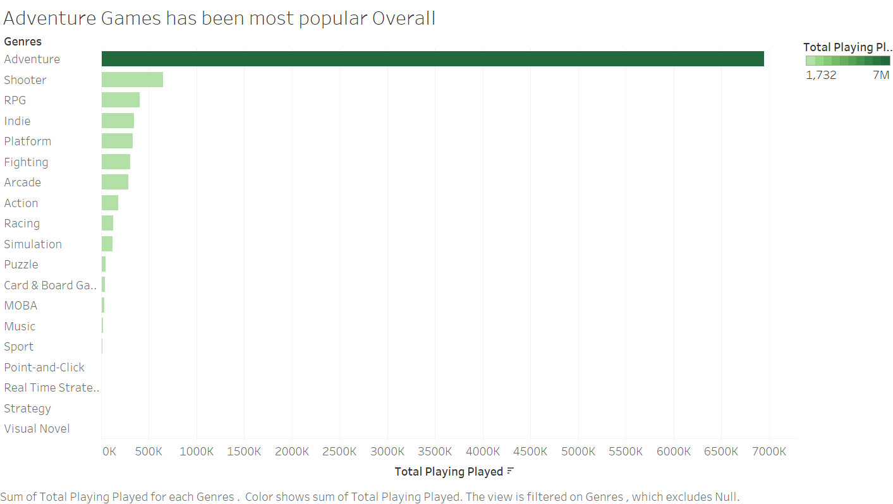
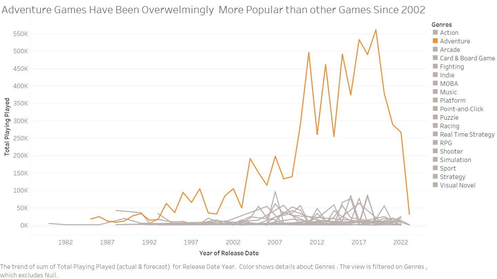
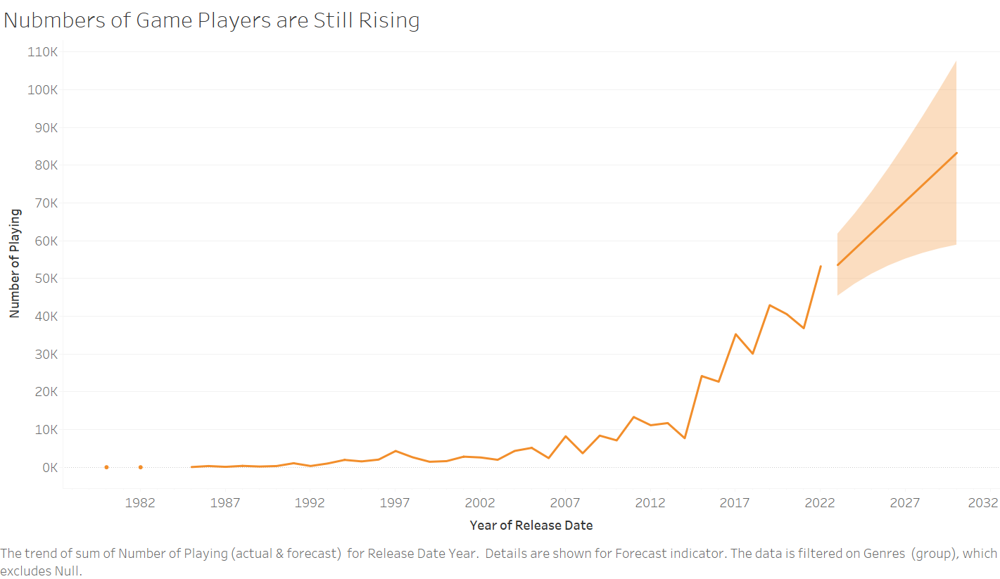
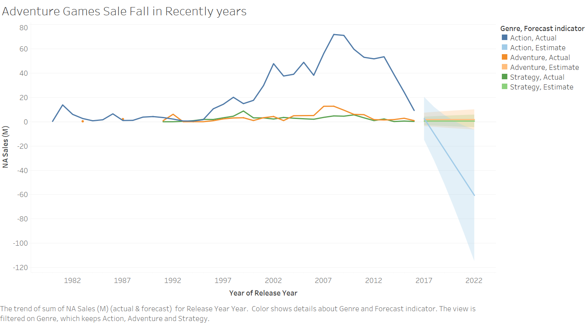

| [home page](https://lihongzhang2023.github.io/portfolio/) | [visualizing debt](visualizing-government-debt) | [critique by design](critique-by-design) | [final project I](final-project-part-one) | [final project II](final-project-part-two) | [final project III](final-project-part-three) |

# Outline
Video games are popular topics among young generations. Although it has been around for only several decades, from arcade to PC, then mobile and now virtual reality, video games have evolved tremendously over time. Many people may be curious to know what kind of games most people are playing, how has the trend changed over time? And how will the trend go in the future? My project is to analyze some video games related dataset from data.world.com to discover answers for these questions in visualizations.  

The project comprises of three parts:
1.	Most played and being playing game genres overview. I plan to use a bar chart graph to give audience an overview of the ranking showing the most popular games overalls.
2.	Most played game genres from 1980 to 2023. A line chart indicates how the trend of games changed from 1980 to 2023, in comparison with game sales trend. We may discover some sign of evolvement in game industry in terms of platforms and notice a huge drop of Adventure Games in both popularity and sales.
3.	Five-year forecast. Ideally, I will be able to show audience a five-year forecast of popular game genres. 
To summarize the concept of the project, video games go back a long way for five decades, adventure games have been always most popular. However, there is a huge fall back in recent years.

## Initial sketches  
1st Part, data viz for Popular Genres Overall
  

2nd Part, Most played game genres from 1980 to 2023
  

Five year forecast
  

North America Sales Forecast in Comparison with Popular Forecast

# The data   
Data source:  
1. Popular Video Games data: Popular Video Games 1980 - 2023, URL: [https://data.world/yansian/popular-video-games](https://www.kaggle.com/datasets/arnabchaki/popular-video-games-1980-2023)

Description: This dataset contains a list of video games dating from 1980 to 2023, with release dates, user review rating, numbers of games users are playing and have played, and numbers of games in wishlist.
   
3. Video Games Sales data: Video Games Sales (1980-2020), URL: [https://data.world/learn-to-viz/martevizanaltica202307/workspace/file?filename=video_games_sales.csv](https://data.world/sumitrock/videogame/workspace/file?filename=Video_Games.csv))

Description: This data set contains vedio Names, Platform, Year of Release, Genre, Publisher, Sales of North America, EU, Japan, and Global. We will only use North America sales data in this project.

# Method and medium  
The project utilizies various tools to compose the data story. The data story is presented digitally using Shorthand with visual contents and a few text to highlight the main takwaway of the story.
