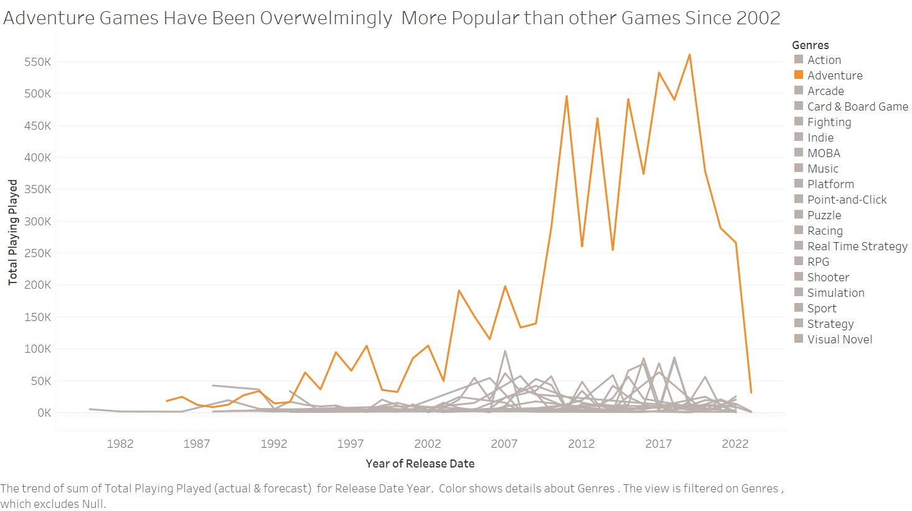

| [home page](https://lihongzhang2023.github.io/portfolio/) | [visualizing debt](visualizing-government-debt) | [critique by design](critique-by-design) | [final project I](final-project-part-one) | [final project II](final-project-part-two) | [final project III](final-project-part-three) |

# Outline
Video games are popular topics among young generations. Although it has been around for only several decades, from arcade to PC, then mobile and now virtual reality, video games have evolved tremendously over time. Many people may be curious to know what kind of games most people are playing, how has the trend changed over time? And how will the trend go in the future? My project is to analyze some video games related dataset from data.world.com to discover answers for these questions in visualizations.  

The project comprises of three parts:
1.	Most played and being playing game genres overview. I plan to use a bar chart graph to give audience an overview of the ranking showing the most popular games overalls.
2.	Most played game genres from 1980 to 2023. A line chart indicates how the trend of games changed from 1980 to 2023, in comparison with game sales trend. We may discover some sign of evolvement in game industry in terms of platforms and notice a huge drop of Adventure Games in both popularity and sales.
3.	Five-year forecast. Ideally, I will be able to show audience a five-year forecast of popular game genres. 
To summarize the concept of the project, video games go back a long way for five decades, adventure games have been always most popular. However, there is a huge fall back in recent years.

## Initial sketches  
1st Part, data viz for Popular Genres Overall

2nd Part, Most played game genres from 1980 to 2023

Five year forecast

North America Sales Forecast in Comparison with Popular Forecast

# The data
> A couple of paragraphs that document your data source(s), and an explanation of how you plan on using your data. 

Text here...

> A link to the publicly-accessible datasets you plan on using, or a link to a copy of the data you've uploaded to your Github repository, Box account or other publicly-accessible location. Using a datasource that is already publicly accessible is highly encouraged.  If you anticipate using a data source other than something that would be publicly available please talk to me first. 

| Name | URL | Description |
|------|-----|-------------|
|      |     |             |
|      |     |             |
|      |     |             |

# Method and medium
> In a few sentences, you should document how you plan on completing your final project. 

Text here...
